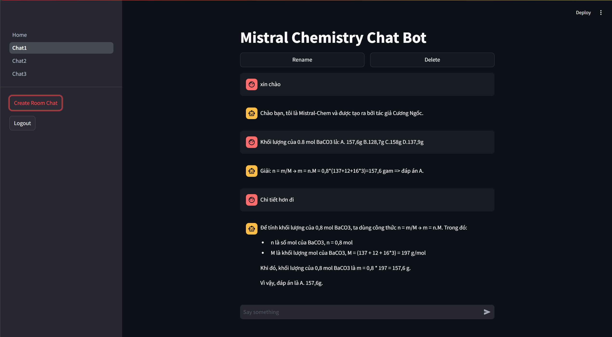
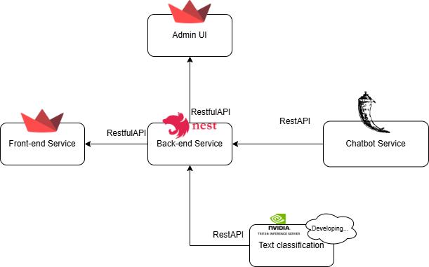

<h1>Mistral Chemistry ChatBot</h1>
<h2>Introduction</h2>
This project aims to develop an advanced chatbot system by combining the power of Large Language Models (LLM) with the field of chemistry. The goal is to create a highly interactive and intelligent assistant that can answer complex queries, provide explanations, and assist in solving problems related to chemistry. By leveraging LLM's ability to process and generate human-like text, the chatbot will be able to understand scientific terminology, interpret chemical formulas, and engage in meaningful conversations about various topics such as organic chemistry, molecular biology, and chemical reactions. This fusion of cutting-edge AI technology with the sciences promises to deliver an innovative tool for both students and professionals in the field of chemistry.

<h2>UX/UI</h2>

<h2>Microservices architecture</h2>

<h2>Services and functions (Source code services)</h2>
    <h4>Chemistry ChatBot: <a href="https://github.com/Luke-lab2002/MistralChemistryChatBot">Built by LLM and RAG </a> </h4>
    <h4>Back-end: <a href="https://github.com/Luke-lab2002/ChatChemistryBackend.git">Built by NestJS and MongoDB</a></h4>
    <h4>Font-end: <a href="https://github.com/Luke-lab2002/StreamlitChemistryChatBot.git">Built by Streamlit</a></h4>
    <h4>Emotion classification (text classification): </h4>
    <h4>Solution for chatbot that can recognize images: OCR or CLIP multimodal (Researching)</h4>
    <h4>Void Recognization for Chatbot (Researching Whisper, Wav2vec)</h4>
    
<h2>Deployment</h2>
I plan to deploy on AWS
